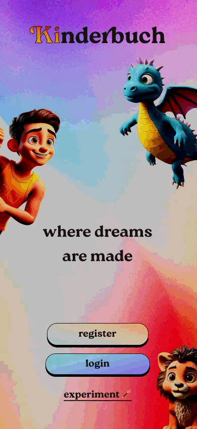

# Kinderbuch-KI

  

  👉 <strong>Try the app here:</strong> 
  https://kinderbuch-ki.vercel.app/

## Einführung

**Kinderbuch-KI** ist eine innovative Plattform, die es Kindern und Eltern ermöglicht, personalisierte, interaktive Geschichten zu erstellen. Mithilfe von KI-Technologie werden Geschichten generiert, die durch kindgerechte Illustrationen, Videofunktionen und Vorlesemöglichkeiten ein einzigartiges Erlebnis schaffen. Unser Ziel ist es, die Kreativität von Kindern zu fördern und Familien über räumliche Distanzen hinweg zu verbinden.

---

## Projektziele
- **Individuelle Geschichten**: Erstellung und Anpassung von Geschichten mithilfe von Prompts und KI.
- **Interaktive Funktionen**: Unterstützung von Videofunktionen, um Eltern und Kinder miteinander zu verbinden.
- **Kindgerechte Gestaltung**: Fokus auf Illustrationen und Inhalte, die für Kinder geeignet sind.
- **Speicherung und Teilen**: Möglichkeit, Geschichten als PDF zu speichern und mit anderen zu teilen.

---

## Hauptfunktionen

### Must-Have-Funktionen
- **Auswahl von Prompts**: Nutzer können durch einfache Eingaben den Verlauf der Geschichte beeinflussen.
- **KI-Generierung**: Geschichten werden in Echtzeit basierend auf den Prompts generiert.
- **Videofunktion**: Eltern und Kinder können per Video interagieren, während sie die Geschichte gemeinsam erleben.

### Should-Have-Funktionen
- **Mehrsprachigkeit**: Unterstützung für mehrere Sprachen.
- **Vorlesefunktion**: Geschichten können mit verschiedenen Stimmen vorgelesen werden.

### Could-Have-Funktionen
- **Animierte AR-Elemente**: Erweiterung der Geschichten durch interaktive, animierte Elemente.
- **Belohnungssystem**: Motivation durch spielerische Elemente.

---

## User Stories

1. **Hauptcharakter wählen**
   - *"Als Kind möchte ich aus verschiedenen Tieren wählen können, um meinen Hauptcharakter zu bestimmen."*
   - **Akzeptanzkriterien**:
     - Es gibt mindestens vier Tiere zur Auswahl.
     - Tiere werden durch Animationen hervorgehoben.

2. **Geschichte speichern**
   - *"Als Nutzer möchte ich die fertige Geschichte speichern können, um sie später erneut anzusehen."*
   - **Akzeptanzkriterien**:
     - Geschichte kann als PDF exportiert werden.
     - Speicherung erfolgt im Benutzerkonto.

3. 2. **Videofunktion nach dem Abschlussprojekt**
   - *"Als Elternteil möchte ich per Videofunktion an der Geschichte teilnehmen können, um mit meinem Kind zu interagieren."*
   - **Akzeptanzkriterien**:
     - Videofunktion ist während des gesamten Prozesses verfügbar.
     - Größe des Videofensters kann angepasst werden.

---

## Entwicklungsmethodik
Das Projekt wird mit **Scrum** umgesetzt, um die agile Entwicklung und kontinuierliche Verbesserung sicherzustellen.

### Scrum-Prozesse
- **Sprint-Dauer**: 3,5 Wochen
- **Scrum-Rollen**:
  - **Product Owner**: Priorisiert Aufgaben und setzt Ziele.
  - **Scrum Master**: Stellt die Einhaltung des Scrum-Prozesses sicher.
  - **Entwicklungsteam**: Implementiert Funktionen (Entwickler, Designer, Tester).
- **Artefakte**:
  - **Product Backlog**: Enthält alle User Stories.
  - **Sprint Backlog**: Aufgaben für den aktuellen Sprint.
  - **Inkrement**: Fertiges Feature nach jedem Sprint.
- **Meetings**:
  - Sprint Planning
  - Daily Standup
  - Sprint Review
  - Sprint Retrospektive

---

## Roadmap

### Sprint 1-2
- Grundlegende Auswahl von Prompts

### Sprint 3-4
- KI-basierte Geschichtengenerierung und Speicherung

### Sprint 5-6
- Videofunktion und Vorlesefunktion

---
## Nützliche Links

[Google-meet](https://meet.google.com/ioa-dxwc-ukt?authuser=0)

[Figma-project](https://www.figma.com/files/team/1200440433546325999/project/331602336/Kinderbuch-ki?fuid=1200440420227567480)

---

## Termine

Meetings  

&nbsp;&nbsp;&nbsp;&nbsp;Mo, Di, Do 18:00  
&nbsp;&nbsp;&nbsp;&nbsp;Mi, Fr 14:30

27.02 Präsentation

---

## Priorisierung (MoSCoW)
- **Must**:
  - Auswahl von Prompts
  - KI-Generierung der Geschichte
  - Videofunktion
- **Should**:
  - Mehrsprachigkeit
  - Vorlesefunktion
- **Could**:
  - Animierte AR-Elemente
  - Belohnungssystem
- **Won't**:
  - Integration in externe Plattformen (vorerst)

---

## Zeit- und Ressourcenplanung
- **Teamkapazität**: 20 Story Points pro Sprint
- **Schätzungen**:
  - Prompts auswählen: 5 Punkte
  - Videofunktion: 8 Punkte
  - Geschichten speichern: 3 Punkte

---

## Risikomanagement

### Risiken
1. **Kindgerechte Inhalte**: Schwierigkeiten bei der KI-Generierung von altersgerechten Geschichten.
2. **Technologische Herausforderungen**: Integration der Videofunktion könnte komplex werden.
3. **Datenschutz**: Umgang mit sensiblen Daten von Kindern.

### Lösungen
- Tests zur Sicherstellung kindgerechter Inhalte
- Zusätzliche Entwicklungsressourcen für die Videofunktion
- Einhaltung der DSGVO- und COPPA-Richtlinien

--- 

## Fazit
**Kinderbuch-KI** bietet eine einzigartige Plattform für Kinder und Eltern, um interaktive Geschichten zu erleben. Durch den  Einsatz von KI-Technologie, kindgerechten Illustrationen und innovativen Funktionen wird das gemeinsame Geschichtenerzählen neu definiert.

**Call-to-Action**: Wir freuen uns über Mitwirkende und Tester, die uns bei der Umsetzung unterstützen! Starten Sie noch heute mit Ihrem ersten Beitrag oder einer Idee!

